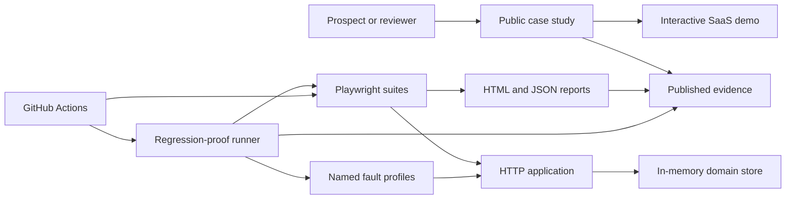

# Revenue Flow Guard Design

**Status:** Accepted from the user's delegated decision mandate

**Decision:** Replace the generic “eight Playwright tests” positioning with a productized SaaS release-confidence case study. Preserve the existing self-contained demo only where it supports that outcome.

## Goal

Build a public, reproducible demonstration that proves a small SaaS team can protect a revenue-critical flow with risk-driven Playwright tests, a reliable CI gate, and evidence that the tests detect representative regressions.

The demo succeeds when a prospect can answer these questions without reading implementation details:

1. What revenue and trust risks are protected?
2. What evidence shows the suite detects faults rather than merely passing?
3. What would be delivered during a client engagement?
4. How can the prospect contact the provider?

## Audience and Offer

The primary audience is a technical founder, engineering lead, or product team at a small SaaS company that ships a browser-based paid product but lacks dependable release gates.

The public offer is **Revenue Flow Guard — SaaS Release Confidence Sprint**. It sells a bounded outcome rather than test count:

- identify one revenue-critical journey and its main failure modes;
- implement or repair the smallest effective Playwright gate;
- integrate it into CI with actionable failure evidence;
- document ownership, operating cost, and extension points;
- deliver a concise risk and handoff report.

Direct SaaS outreach is the primary acquisition channel. A marketplace listing may reuse the same case study as a secondary channel. Pricing and public contact details are publication inputs, not application behavior; they must be approved before public deployment.

## Scope

### In scope

- A self-contained storefront-style SaaS sample with authentication, catalog, cart, checkout, and order confirmation.
- Server-enforced session and authorization behavior.
- A fake payment-token flow that never accepts or stores real card data.
- Server-side order validation and idempotent submission.
- Playwright UI and API coverage for the critical journey and failure paths.
- A deterministic regression-proof harness covering six named business faults.
- Pull-request CI, scheduled cross-browser CI, lint, type checking, and report artifacts.
- A public case-study page that explains the offer, method, evidence, limitations, and call to action.
- Evidence-based documentation with verifiable primary sources and no unsupported performance claims.

### Out of scope

- Real payment processing, production identity, or persistent customer data.
- A general-purpose testing framework or reusable npm package.
- Broad unit-test coverage of the sample application.
- AI-generated tests, self-healing locators, visual-diff infrastructure, load testing, or mobile-native testing.
- Claims about client savings, defect reduction, or return on investment without client evidence.
- Building the later n8n demonstration.

## System Boundaries



The public case study, sample application, test suites, and regression-proof runner are separate units. The case study consumes generated evidence but does not know test internals. The runner invokes the normal tests against controlled fault profiles; it does not contain duplicate business assertions.

## Application Design

### HTTP application

`server.js` remains a dependency-light Node HTTP server. Its responsibilities are limited to static assets, JSON parsing, session cookies, API routing, domain validation, and controlled fault-profile activation.

All JSON endpoints return a consistent shape:

```json
{
  "data": {},
  "error": null
}
```

Failures set `data` to `null` and return a stable error object:

```json
{
  "data": null,
  "error": { "code": "OUT_OF_STOCK", "message": "This item is no longer available." }
}
```

Malformed JSON, oversized bodies, unknown routes, invalid sessions, invalid input, and duplicate requests must return controlled 4xx responses. Unexpected failures return a generic 500 response without stack traces.

### Session model

`POST /api/session` accepts the fixed demonstration credentials and creates an opaque, random session ID held in the server's in-memory store. The browser receives an `HttpOnly`, `SameSite=Strict` cookie. `DELETE /api/session` invalidates it. Protected API routes and protected screens require a valid session.

This is a local demonstration boundary, not a production identity implementation. Password hashing, account recovery, MFA, and durable sessions remain outside scope.

### Catalog and cart

`GET /api/products` returns stable product IDs, display names, prices in integer cents, and available quantities. The browser owns the temporary cart, but the server recomputes prices and validates availability during checkout. Client totals are never authoritative.

### Fake payment token

The checkout UI accepts only a documented fake token such as `tok_demo_approved` or `tok_demo_declined`. It never renders a card-number field and the server never accepts PAN-like data. The token endpoint models approval, decline, and transient failure without a third-party dependency.

### Order submission

`POST /api/orders` requires:

- an authenticated session;
- at least one valid product and quantity;
- a supported fake payment token;
- an `Idempotency-Key` header generated once per checkout attempt.

The server calculates the amount, validates stock, records the successful result against the idempotency key, and returns the same order for a repeated identical request. Reuse of the key with a different payload returns `409 IDEMPOTENCY_CONFLICT`.

### Reset and fault controls

Test-only control endpoints are enabled only when the server starts with `DEMO_TEST_MODE=1`. They reset server state and select one named fault profile. They must reject requests in normal demo mode.

## Named Regression Corpus

The suite must prove detection of exactly these six faults:

| Fault ID | Injected defect | Required detecting test |
|---|---|---|
| `AUTH_BYPASS` | Protected catalog is returned without a valid session | Unauthorized-access API test |
| `CLIENT_PRICE_TRUST` | Server accepts a client-supplied total | Server-calculated-total API test |
| `DUPLICATE_ORDER` | Repeated idempotency key creates another order | Idempotent-order API test |
| `EMPTY_CART_ACCEPTED` | Checkout succeeds with no line items | Empty-cart validation test |
| `PAYMENT_DECLINE_HIDDEN` | Declined token is shown as success | Declined-payment UI test |
| `SUBMIT_REENABLED` | Submit control permits a duplicate in-flight action | Double-submit UI test |

Each profile changes one behavior. The regression-proof runner starts an isolated server for a profile, executes only the named detecting test, and succeeds only when that test fails for the expected business reason. A fault that does not trigger its designated test fails the proof run.

The baseline suite must pass before regression proof begins. Generated evidence records the baseline result, every fault ID, the detecting test, the expected failure signature, and the observed result.

## Test Architecture

### API tests

API tests own session enforcement, server validation, price authority, idempotency, reset controls, malformed requests, and error contracts. They use `APIRequestContext` and create their own state.

### UI tests

UI tests own observable user journeys:

- sign in and sign out;
- browse products and build a cart;
- complete one approved checkout;
- see an actionable payment decline;
- prevent or safely absorb a double submit;
- recover from an order-service failure without losing the cart.

UI tests use user-facing roles, labels, text, or explicit test IDs. CSS and XPath selectors are not allowed in product tests. Assertions use Playwright's retrying web-first matchers. Fixed sleeps are not allowed.

### Fixtures

Fixtures expose behavior, not collections of unused locators:

- `authenticatedPage` provisions a session appropriate for the current worker;
- `testApi` resets state and provides typed API helpers;
- small screen objects are introduced only when at least two tests share meaningful actions.

Every exported fixture or helper must have a consumer. Tests may duplicate short readable flows instead of introducing speculative abstractions.

### Isolation

Tests do not depend on order. API state is reset for each test, and UI tests use isolated browser contexts. Parallel execution must not share mutable accounts or idempotency keys. The baseline suite must pass three consecutive runs locally without retries before publication.

## Quality Gates and CI

The pull-request workflow runs:

1. `npm ci`
2. `npx playwright install chromium --with-deps`
3. lint
4. TypeScript type checking
5. the Chromium baseline suite with one worker
6. regression proof
7. report and evidence upload, even after test failure

The workflow does not cache Playwright browser binaries. It may cache npm through `setup-node` using `package-lock.json`.

A scheduled or manually dispatched workflow runs Chromium, Firefox, and WebKit. Cross-browser failures do not silently retry into a passing state; retry classification remains visible in the report.

The repository badge must point to a real workflow in the published repository. Local screenshots or hand-written pass tables are supplementary and dated; they never replace CI evidence.

## Public Case Study

The root route is the interactive demo. `/case-study.html` is the commercial entry point and contains:

1. a direct headline about protecting a revenue-critical release flow;
2. the six risks demonstrated;
3. a concise architecture and delivery method;
4. generated baseline and regression-proof results;
5. exact limitations and applicability boundaries;
6. the sprint deliverables and engagement shape;
7. a contact call to action supplied before publication.

The page must work without JavaScript for its commercial content. Generated evidence may be progressively enhanced. It must be responsive, keyboard usable, and readable at 200% zoom.

No claim may imply that this synthetic demonstration produced client revenue, reduced production defects, or guarantees a release outcome.

## Documentation and Evidence

The existing README, test plan, QA report, and handoff guide are replaced or corrected to describe present state only. The QA report is generated from an actual run or clearly labeled as a dated snapshot.

Scientific sources justify narrow design choices, not marketing outcomes:

- Luo et al. classify flaky-test root causes; they do not prove this suite is non-flaky.
- WEFix supports condition-based waits over fixed delays; its reported 98% correctness and runtime-overhead result must not be rewritten as a 73% flakiness reduction.
- Inozemtseva and Holmes show why coverage alone is an insufficient effectiveness target; regression proof is still a synthetic demonstration, not equivalent to real-fault validation.
- Google’s 70/20/10 split is a practitioner starting point, not a universal scientific optimum.
- Playwright documentation is the authority for current framework behavior and CI recommendations.

Every citation includes a title, authors or owner, year when applicable, stable URL or DOI, and the exact claim it supports.

## Error Handling

- Browser errors remain actionable and preserve user input where safe.
- Server errors use stable codes and correct HTTP status classes.
- The UI distinguishes validation, authentication, payment decline, conflict, and temporary service failure.
- Test helpers fail with the fault ID, request context, and expected contract, without logging session cookies or fake credentials as secrets.
- Generated evidence handles an interrupted run by marking it incomplete rather than presenting stale success.

## Security and Privacy Boundaries

- No real payment, credential, analytics, or customer data enters the demo.
- Session IDs are random, server-side, and redacted from logs.
- Authentication state and reports containing request context remain gitignored unless sanitized.
- Test-only controls are disabled in public runtime mode.
- Public contact information is not inferred from private connector metadata; the user must approve it before publication.

## Deployment

The application must read its port and public base URL from runtime configuration while retaining deterministic local defaults. A health endpoint allows deployment verification without changing state.

Publication requires:

- a Git repository with a clean, reviewable history;
- a pushed commit matching the deployed source;
- a successful public CI run;
- a deployed public URL with test controls disabled;
- approved contact information and offer wording;
- a smoke test of the public demo and case-study routes.

Deployment credentials and custom-domain configuration are operational inputs, not repository content.

## Acceptance Criteria

### Product behavior

- An unauthenticated browser and API client cannot access protected product or order data.
- Approved fake checkout creates one order; the same idempotency key cannot create a second order.
- Declined and failed fake payments never show confirmation.
- Server-calculated amounts and stock determine the order result.

### Test effectiveness

- The baseline UI and API suite passes three consecutive local runs without retries.
- Each of the six named faults is detected by its designated test with the expected failure signature.
- Removing or weakening a designated assertion causes regression proof to fail.

### Maintainability

- Lint and TypeScript type checking pass with no warnings.
- No unused exported fixture, helper, route, script, or documentation promise remains.
- Tests contain no fixed sleeps, CSS/XPath selectors, shared ordering, or unbounded external dependencies.

### Publication

- CI evidence is public and linked from the case study.
- The public runtime exposes no test-control endpoint and no real sensitive data.
- The case study identifies the offer, evidence, limitations, and approved contact path.
- The live URL passes desktop and mobile smoke checks.

## Stop Conditions

Do not publish if any of these remain true:

- a scientific or commercial claim lacks a verifiable source;
- a named fault is not detected;
- CI has not run on the exact published commit;
- the public runtime enables reset or fault controls;
- the call to action contains unapproved personal information;
- the deployed source differs from the reviewed repository state.

## Primary References

- Microsoft, *Playwright Best Practices*: https://playwright.dev/docs/best-practices
- Microsoft, *Playwright Continuous Integration*: https://playwright.dev/docs/ci
- Microsoft, *Playwright Authentication*: https://playwright.dev/docs/auth
- Qingzhou Luo, Farah Hariri, Lamyaa Eloussi, and Darko Marinov, *An Empirical Analysis of Flaky Tests*, FSE 2014, https://doi.org/10.1145/2635868.2635920
- Xinyue Liu, Zihe Song, Weike Fang, Wei Yang, and Weihang Wang, *WEFix: Intelligent Automatic Generation of Explicit Waits for Efficient Web End-to-End Flaky Tests*, WWW 2024, https://doi.org/10.1145/3589334.3645628
- Laura Inozemtseva and Reid Holmes, *Coverage Is Not Strongly Correlated with Test Suite Effectiveness*, ICSE 2014, https://doi.org/10.1145/2568225.2568271
- Mike Wacker, *Just Say No to More End-to-End Tests*, Google Testing Blog, 2015, https://testing.googleblog.com/2015/04/just-say-no-to-more-end-to-end-tests.html
- OWASP, *HTML5 Security Cheat Sheet*: https://cheatsheetseries.owasp.org/cheatsheets/HTML5_Security_Cheat_Sheet.html

