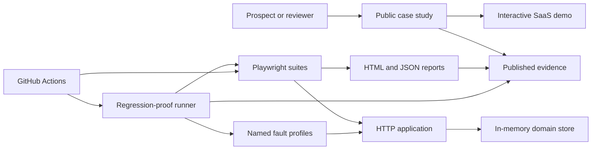

# Revenue Flow Guard Design

**Status:** Accepted from the user's delegated decision mandate

**Decision:** Replace the generic “eight Playwright tests” positioning with a productized SaaS release-confidence case study. Preserve the existing self-contained demo only where it supports that outcome.

## Goal

Build a public, reproducible demonstration that proves a small SaaS team can protect a revenue-critical flow with risk-driven Playwright tests, a reliable CI gate, and evidence that the tests detect representative regressions.

The demo succeeds when a prospect can answer these questions without reading implementation details:

1. What revenue and trust risks are protected?
2. What evidence shows the suite detects faults rather than merely passing?
3. What would be delivered during a client engagement?
4. How can the prospect contact the provider?

## Audience and Offer

The primary audience is a technical founder, engineering lead, or product team at a small SaaS company that ships a browser-based paid product but lacks dependable release gates.

The public offer is **Revenue Flow Guard — SaaS Release Confidence Sprint**. It sells a bounded outcome rather than test count:

- identify one revenue-critical journey and its main failure modes;
- implement or repair the smallest effective Playwright gate;
- integrate it into CI with actionable failure evidence;
- document ownership, operating cost, and extension points;
- deliver a concise risk and handoff report.

Direct SaaS outreach is the primary acquisition channel. A marketplace listing may reuse the same case study as a secondary channel. Pricing and public contact details are publication inputs, not application behavior; they must be approved before public deployment.

## Scope

### In scope

- A self-contained storefront-style SaaS sample with authentication, catalog, cart, checkout, and order confirmation.
- Server-enforced session and authorization behavior.
- A fake payment-token flow that never accepts or stores real card data.
- Server-side order validation and idempotent submission.
- Playwright UI and API coverage for the critical journey and failure paths.
- A deterministic regression-proof harness covering six named business faults.
- Pull-request CI, scheduled cross-browser CI, lint, type checking, and report artifacts.
- A public case-study page that explains the offer, method, evidence, limitations, and call to action.
- Evidence-based documentation with verifiable primary sources and no unsupported performance claims.

### Out of scope

- Real payment processing, production identity, or persistent customer data.
- A general-purpose testing framework or reusable npm package.
- Broad unit-test coverage of the sample application.
- AI-generated tests, self-healing locators, visual-diff infrastructure, load testing, or mobile-native testing.
- Claims about client savings, defect reduction, or return on investment without client evidence.
- Building the later n8n demonstration.

## System Boundaries



The public case study, sample application, test suites, and regression-proof runner are separate units. The case study consumes generated evidence but does not know test internals. The runner invokes the normal tests against controlled fault profiles; it does not contain duplicate business assertions.

## Application Design

### HTTP application

`server.js` remains a dependency-light Node HTTP server. Its responsibilities are limited to static assets, JSON parsing, session cookies, API routing, domain validation, and controlled fault-profile activation.

All JSON endpoints return a consistent shape:

```json
{
  "data": {},
  "error": null
}
```

Failures set `data` to `null` and return a stable error object:

```json
{
  "data": null,
  "error": { "code": "OUT_OF_STOCK", "message": "This item is no longer available." }
}
```

Malformed JSON, oversized bodies, unknown routes, invalid sessions, invalid input, and duplicate requests must return controlled 4xx responses. Unexpected failures return a generic 500 response without stack traces.

Request bodies are limited to 16 KiB. The server rejects a body over that limit with `413 BODY_TOO_LARGE`, malformed JSON with `400 INVALID_JSON`, an unsupported media type with `415 UNSUPPORTED_MEDIA_TYPE`, and an unknown route with `404 NOT_FOUND`. “Duplicate request” does not include a valid idempotent order replay; order-specific replay semantics are defined below.

### Route contracts

| Method and route | Request | Success | Controlled failures |
|---|---|---|---|
| `GET /api/health` | none | `200` and the exact health shape defined below; no mutable state | none |
| `POST /api/session` | `{ username, password }`, each 1–100 characters | `201`, public user profile plus session cookie | `400 INVALID_INPUT`, `401 INVALID_CREDENTIALS` |
| `DELETE /api/session` | valid session cookie when present | `204`; repeated logout is also `204` | none |
| `GET /api/session` | session cookie | `200`, public user profile | `401 AUTH_REQUIRED` |
| `GET /api/products` | session cookie | `200`, stable product array | `401 AUTH_REQUIRED` |
| `POST /api/payment-tokens` | session cookie and `{ scenario }` where scenario is `approved`, `declined`, or `transient_failure` | `201`, one-time opaque fake token and expiry | `400 INVALID_INPUT`, `401 AUTH_REQUIRED` |
| `POST /api/orders` | session cookie, `Idempotency-Key`, `{ items, paymentToken }` | first success `201`; completed replay `200` | status/code mapping defined below |

Order items contain only `{ productId, quantity }`; quantity is an integer from 1 through 10, the list contains 1 through 20 distinct products, and duplicate product IDs are rejected with `400 INVALID_ITEMS`. The server ignores and rejects client-supplied prices or totals with `400 CLIENT_AMOUNT_FORBIDDEN`.

Health responses use this exact body in normal mode:

```json
{
  "data": { "status": "ok", "version": 1, "testMode": false },
  "error": null
}
```

Test mode changes only `testMode` to `true`; health never exposes the test token, fault ID, sessions, or mutable counts.

### Session model

`POST /api/session` accepts the fixed demonstration credentials and creates an opaque, random session ID held in the server's in-memory store. The browser receives an `HttpOnly`, `SameSite=Strict` cookie. `DELETE /api/session` invalidates it. Protected API routes and protected screens require a valid session.

This is a local demonstration boundary, not a production identity implementation. Password hashing, account recovery, MFA, and durable sessions remain outside scope.

### Catalog and cart

`GET /api/products` returns stable product IDs, display names, prices in integer cents, and available quantities. The browser owns the temporary cart, but the server recomputes prices and validates availability during checkout. Client totals are never authoritative.

### Fake payment token

The checkout UI presents three clearly labeled demonstration payment outcomes: approved, declined, and temporary failure. It never renders a card-number field and the server rejects PAN-like fields. The UI exchanges the selected outcome through `POST /api/payment-tokens` for a random, single-use token that expires after five minutes. The order endpoint accepts only that opaque token. A declined token returns `402 PAYMENT_DECLINED`; a temporary-failure token returns `503 PAYMENT_UNAVAILABLE` with `Retry-After: 1`; an expired or reused token returns `409 PAYMENT_TOKEN_INVALID`. No third-party service is involved.

### Order submission

`POST /api/orders` requires:

- an authenticated session;
- at least one valid product and quantity;
- a supported fake payment token;
- an `Idempotency-Key` header generated once per checkout attempt.

After authentication and pre-idempotency structural validation, the server canonicalizes the logical request as `{ items, paymentToken }`: items are sorted first by numeric product ID and then by numeric quantity, and object keys use the documented order. The quantity tie-breaker makes even an invalid duplicate-product payload order-independent. Pre-idempotency failures are not cached: missing/invalid key, non-object body, unknown top-level or item fields, client amount/price fields, non-array items, non-object item entries, non-integer/out-of-range quantities, and a non-string payment token. The server hashes the UTF-8 canonical JSON with SHA-256. Whitespace, JSON property order, and input item order therefore do not change the request hash.

Idempotency lookup always precedes product, stock, and payment-token lookup. Key handling is atomic within the single Node process:

1. If the key exists with another hash, return `409 IDEMPOTENCY_CONFLICT`.
2. If the matching record is `pending`, return `409 ORDER_IN_PROGRESS` with `Retry-After: 1` without reading or consuming the payment token.
3. If the matching record is `completed`, return its stored status and body without revalidating products, stock, or token. Successful replay changes the response status from the first request's `201` to `200` and adds `replayed: true`; a deterministic failure replay preserves its original status and body.
4. If the key is new, reserve `{ key, requestHash, state: "pending" }` before domain validation, payment, or order creation.
5. After reservation, these domain failures become completed deterministic records with their exact response: empty item list, duplicate product ID, unknown product ID, insufficient stock, expired/invalid/consumed token, and payment decline. Pre-idempotency structural failures listed above are never reserved or cached.
6. Approved payment consumes the token only in the same synchronous commit that decrements stock, creates the order, and completes the idempotency record.
7. Payment decline consumes the token and completes the record with the cached `402` response.
8. A transient payment failure does not consume the token and deletes the pending record, allowing the same key, hash, and token to be retried.

Stock is decremented only when the pending record transitions to a successful completed order. Every controlled order failure leaves stock unchanged.

`POST /api/orders` uses this complete controlled-failure mapping:

| Condition | HTTP status and code |
|---|---|
| Missing/invalid session | `401 AUTH_REQUIRED` |
| Missing idempotency key or invalid body | `400 INVALID_ORDER` |
| Client price or total present | `400 CLIENT_AMOUNT_FORBIDDEN` |
| Empty, duplicate, unknown, or invalid-quantity items | `400 INVALID_ITEMS` |
| Insufficient stock | `409 OUT_OF_STOCK` |
| Same key, different request hash | `409 IDEMPOTENCY_CONFLICT` |
| Same key/hash still pending | `409 ORDER_IN_PROGRESS` with `Retry-After: 1` |
| Expired or already consumed token | `409 PAYMENT_TOKEN_INVALID` |
| Declined token | `402 PAYMENT_DECLINED` |
| Temporary payment failure | `503 PAYMENT_UNAVAILABLE` with `Retry-After: 1` |

### Reset and fault controls

Test-only control endpoints are registered only when the server starts with `DEMO_TEST_MODE=1`. In normal demo mode they are absent and receive the same generic `404 NOT_FOUND` response as any unknown route. Test mode binds to loopback only and requires a random run token passed by the test process; requests without that token receive `404`, not an authentication hint.

The test process supplies `DEMO_TEST_TOKEN`, and every control request sends it as `X-RFG-Test-Token`. Test-mode contracts are:

| Method and route | Request | Success behavior |
|---|---|---|
| `POST /__test/reset` | no body | `204`; restore product stock, clear sessions, orders, payment tokens, idempotency records, request counters, and active fault |
| `PUT /__test/fault` | `{ faultId }`, where the value is one of the six corpus IDs or `NONE` | `200` with `{ data: { faultId }, error: null }`; reset all mutable state before activating that fault |
| `GET /__test/state` | no body | `200` with `{ data: { faultId, orderCount, pendingOrderCount, orderRequestCount }, error: null }` |

Malformed authorized control requests receive `400 INVALID_TEST_CONTROL`. Missing or wrong run tokens receive the generic `404 NOT_FOUND` body. Fault state is process-local and cannot change through normal application routes.

Protected browser routes are client-side screens over the protected API boundary. On initial load and every hash change to `#dashboard` or `#checkout`, the browser calls `GET /api/session` before rendering protected content. A `401` clears local cart state, replaces the URL hash with `#login`, and renders only the sign-in screen. Direct navigation to a protected hash must never briefly render protected product or order data.

## Named Regression Corpus

The suite must prove detection of exactly these six faults:

| Fault ID | Injected defect | Required detecting test |
|---|---|---|
| `AUTH_BYPASS` | Protected catalog is returned without a valid session | Unauthorized-access API test |
| `CLIENT_PRICE_TRUST` | Server accepts a client-supplied total | Server-calculated-total API test |
| `DUPLICATE_ORDER` | Repeated idempotency key creates another order | Idempotent-order API test |
| `EMPTY_CART_ACCEPTED` | Checkout succeeds with no line items | Empty-cart validation test |
| `PAYMENT_DECLINE_HIDDEN` | Declined token is shown as success | Declined-payment UI test |
| `SUBMIT_CONTROL_MISSING` | Submit control remains enabled while the first order request is pending | In-flight-submit UI test |

Each profile changes one behavior. Every designated assertion carries an exact message `RFG:<fault-id>:<contract-id>`. The regression manifest maps one fault ID to one fully qualified Playwright test ID and one exact assertion-message prefix.

The regression-proof runner performs these steps for each profile:

1. start a fresh isolated server and verify `/api/health` plus the active fault ID through the token-protected test control;
2. execute only the manifest's test with Playwright's JSON reporter and retries disabled;
3. require that the designated test is the only failed test;
4. require its error message to contain the mapped `RFG:` signature;
5. reject timeouts, browser-launch failures, fixture failures, server exits, missing results, and mismatched signatures as infrastructure/proof failures;
6. shut down the server and record the sanitized result.

`SUBMIT_CONTROL_MISSING` delays the first order response after the server accepts it. Its designated assertion checks that the submit button becomes disabled before the response is released. Server idempotency is proven separately and is not accepted as a substitute for that UI contract.

The baseline suite must pass before regression proof begins. Static validation also requires every manifest signature to occur exactly once in the mapped test source. This verifies the proof wiring, not the semantic strength of arbitrary assertions.

## Evidence Manifest

The runner writes `artifacts/public-evidence/evidence.json` using this versioned shape:

```json
{
  "schemaVersion": 1,
  "source": { "commitSha": "…", "ciRunId": "…", "ciRunUrl": "…" },
  "generatedAt": "2026-07-11T00:00:00Z",
  "complete": true,
  "sanitized": true,
  "baseline": { "status": "passed", "tests": 0, "retries": 0, "durationMs": 0 },
  "faults": [
    {
      "id": "AUTH_BYPASS",
      "testId": "api/auth.spec.ts > rejects unauthenticated access",
      "expectedSignature": "RFG:AUTH_BYPASS:AUTH_REQUIRED",
      "status": "detected",
      "observedSignature": "RFG:AUTH_BYPASS:AUTH_REQUIRED"
    }
  ]
}
```

`complete` is true only when the baseline and all six faults were evaluated. `sanitized` is true only after the publication validator passes. The case study renders positive evidence only when both are true, the schema is supported, all six fault IDs are present exactly once, and `source.commitSha` equals the deployed source commit supplied at build time. Otherwise it renders an explicit “Evidence unavailable or incomplete” state and no pass totals.

The deployment pipeline copies this manifest to `/evidence/latest.json`; the application never falls back to a checked-in or previous manifest. `generatedAt`, commit SHA, run ID, and run URL remain visible on the case study.

## Test Architecture

### API tests

API tests own session enforcement, server validation, price authority, idempotency, reset controls, malformed requests, and error contracts. They use `APIRequestContext` and create their own state.

### UI tests

UI tests own observable user journeys:

- sign in and sign out;
- browse products and build a cart;
- complete one approved checkout;
- see an actionable payment decline;
- prevent or safely absorb a double submit;
- recover from an order-service failure without losing the cart.

UI tests use user-facing roles, labels, text, or explicit test IDs. CSS and XPath selectors are not allowed in product tests. Assertions use Playwright's retrying web-first matchers. Fixed sleeps are not allowed.

### Fixtures

Fixtures expose behavior, not collections of unused locators:

- `authenticatedPage` provisions a session appropriate for the current worker;
- `testApi` resets state and provides typed API helpers;
- small screen objects are introduced only when at least two tests share meaningful actions.

Every exported fixture or helper must have a consumer. Tests may duplicate short readable flows instead of introducing speculative abstractions.

### Isolation

Tests do not depend on order. API state is reset for each test, and UI tests use isolated browser contexts. Parallel execution must not share mutable accounts or idempotency keys. The baseline suite must pass three consecutive runs locally without retries before publication.

## Quality Gates and CI

The pull-request workflow runs:

1. `npm ci`
2. `npx playwright install chromium --with-deps`
3. lint
4. TypeScript type checking
5. the Chromium baseline suite with one worker
6. regression proof
7. report and evidence upload, even after test failure

The workflow does not cache Playwright browser binaries. It may cache npm through `setup-node` using `package-lock.json`.

A scheduled or manually dispatched workflow runs Chromium, Firefox, and WebKit. Cross-browser failures do not silently retry into a passing state; retry classification remains visible in the report.

The public artifact contains only the evidence manifest and a static summary generated from it. Traces, videos, raw Playwright JSON, cookies, request headers, absolute home paths, and server logs are never placed in the public artifact. `npm run validate:public-artifacts` rejects binary files and scans every text file under `artifacts/public-evidence/` for session-cookie names and values, authorization headers, absolute workspace paths, credential strings, private-key headers, known GitHub/OpenAI token prefixes, and 13–19 digit PAN-like sequences; any match or unreadable file makes sanitization fail closed. Screenshots are excluded from the public artifact. Full debugging artifacts, when enabled for a private run, are not uploaded by public workflows.

`npm run scan:secrets` scans the paths returned by `git ls-files` plus `artifacts/public-evidence/` using the same credential/private-key/token rules. It rejects tracked `.env` files other than `.env.example`, rejects binary public artifacts, exits non-zero on any match or scan error, and writes `artifacts/validation/secret-scan.json` containing the commit SHA, scanned-file count, zero-match count, and validator version on success. The only allowlist is a repository file of exact documented fake values; regex or path-wide exclusions are forbidden.

The repository badge must point to a real workflow in the published repository. Local screenshots or hand-written pass tables are supplementary and dated; they never replace CI evidence.

## Public Case Study

The root route is the interactive demo. `/case-study.html` is the commercial entry point and contains:

1. a direct headline about protecting a revenue-critical release flow;
2. the six risks demonstrated;
3. a concise architecture and delivery method;
4. generated baseline and regression-proof results;
5. exact limitations and applicability boundaries;
6. the sprint deliverables and engagement shape;
7. a contact call to action supplied before publication.

The page must work without JavaScript for its commercial content. Generated evidence may be progressively enhanced, but the static fallback states only that live evidence requires JavaScript and never embeds stale success. It must be responsive, keyboard usable, and readable at 200% zoom.

No claim may imply that this synthetic demonstration produced client revenue, reduced production defects, or guarantees a release outcome.

## Documentation and Evidence

The existing README, test plan, QA report, and handoff guide are replaced or corrected to describe present state only. The QA report is generated from an actual run or clearly labeled as a dated snapshot.

Scientific sources justify narrow design choices, not marketing outcomes:

- Luo et al. classify flaky-test root causes; they do not prove this suite is non-flaky.
- WEFix supports condition-based waits over fixed delays; its reported 98% correctness and runtime-overhead result must not be rewritten as a 73% flakiness reduction.
- Inozemtseva and Holmes show why coverage alone is an insufficient effectiveness target; regression proof is still a synthetic demonstration, not equivalent to real-fault validation.
- Google’s 70/20/10 split is a practitioner starting point, not a universal scientific optimum.
- Playwright documentation is the authority for current framework behavior and CI recommendations.

Every citation includes a title, authors or owner, year when applicable, stable URL or DOI, and the exact claim it supports.

## Error Handling

- Browser errors remain actionable and preserve user input where safe.
- Server errors use stable codes and correct HTTP status classes.
- The UI distinguishes validation, authentication, payment decline, conflict, and temporary service failure.
- Test helpers fail with the fault ID, request context, and expected contract, without logging session cookies or fake credentials as secrets.
- Generated evidence handles an interrupted run by marking it incomplete rather than presenting stale success.

## Security and Privacy Boundaries

- No real payment, credential, analytics, or customer data enters the demo.
- Session IDs are random, server-side, and redacted from logs. Local HTTP development uses `HttpOnly; SameSite=Strict; Path=/`; any HTTPS base URL additionally requires `Secure`. Public deployment is HTTPS-only and rejects plain-HTTP requests at the hosting edge.
- Authentication state and reports containing request context remain gitignored unless sanitized.
- Test-only controls are not registered in public runtime mode.
- Public contact information is not inferred from private connector metadata; the user must approve it before publication.

## Deployment

The application must read its port and public base URL from runtime configuration while retaining deterministic local defaults. A health endpoint allows deployment verification without changing state.

Publication requires:

- a Git repository where `git status --porcelain` is empty, `git fsck --no-dangling` succeeds, and `npm run scan:secrets` exits zero with a current-commit zero-match report;
- a pushed commit matching the deployed source;
- a successful public CI run;
- a deployed public URL with test controls disabled;
- approved contact information and offer wording;
- a smoke test of the public demo and case-study routes.

Deployment credentials and custom-domain configuration are operational inputs, not repository content.

## Implementation Milestones

The design is implemented through three independently verifiable plans. A later milestone may not weaken an earlier milestone's contracts.

### Milestone 1 — Secure revenue flow and baseline gate

Owns the HTTP application, browser UI, route contracts, session model, payment tokens, idempotent orders, API tests, UI tests, lint, and type checking. It stops when product behavior and three-run baseline acceptance pass locally. It does not build fault profiles, public evidence, the commercial case study, or deployment.

### Milestone 2 — Regression proof and CI evidence

Owns fault profiles, the proof runner, signature manifest, evidence schema, publication sanitizer, pull-request workflow, and scheduled cross-browser workflow. It stops when all six faults are detected without false-positive infrastructure failures and a sanitized complete manifest is produced for the current commit. It does not decide pricing, contact details, or hosting.

### Milestone 3 — Case study and publication

Owns the commercial page, corrected documentation, evidence rendering, repository publication, hosting, and public smoke checks. Implementation can finish with an explicit `publication-inputs-missing` state if approved contact wording, deployment access, or repository access is unavailable. Public deployment remains incomplete until every publication criterion passes.

## Acceptance Criteria

### Product behavior

- An unauthenticated browser and API client cannot access protected product or order data.
- Approved fake checkout creates one order; the same idempotency key cannot create a second order.
- Declined and failed fake payments never show confirmation.
- Server-calculated amounts and stock determine the order result.

### Test effectiveness

- The baseline UI and API suite passes three consecutive local runs without retries.
- Each of the six named faults is detected by its designated test with the expected failure signature.
- A startup, fixture, timeout, browser, or mismatched-assertion failure cannot satisfy regression proof.
- Signature-manifest validation passes and every mapped signature occurs exactly once in its test source.

### Maintainability

- `npm run lint -- --max-warnings=0` and `npm run typecheck` pass.
- No unused exported fixture or test helper remains, every registered API route has a contract test, and every repository script is referenced by `package.json` or CI.
- Tests contain no fixed sleeps, CSS/XPath selectors, shared ordering, or unbounded external dependencies.
- `npm run validate:docs` finds no placeholder repository owner, unsupported numeric claim, broken local link, or stale hand-written pass total.
- `npm run validate:repo` fails when a first-party exported test helper or fixture has no importing consumer, a file under `scripts/` has no `package.json` or CI reference, a package script references a missing file, or a documented npm command is absent from `package.json`; route-contract tests exercise every registered API route.

### Publication

- CI evidence is public and linked from the case study.
- The public runtime exposes no test-control endpoint and no real sensitive data.
- The public URL uses HTTPS and its session cookie includes `Secure`, `HttpOnly`, `SameSite=Strict`, and `Path=/`.
- The case study identifies the offer, evidence, limitations, and approved contact path.
- The evidence manifest passes schema, commit-match, completeness, and sanitization checks before the case study shows success.
- The live `/`, `/case-study.html`, `/api/health`, and `/evidence/latest.json` routes pass smoke checks at 1280×720 Desktop Chrome and the Playwright `Pixel 7` viewport; both page routes have no horizontal overflow, all primary controls are keyboard reachable, and the health/evidence responses satisfy their schemas.

## Stop Conditions

Do not publish if any of these remain true:

- a scientific or commercial claim lacks a verifiable source;
- a named fault is not detected;
- CI has not run on the exact published commit;
- the public runtime enables reset or fault controls;
- the call to action contains unapproved personal information;
- the deployed source differs from the reviewed repository state.

## Primary References

- Microsoft, *Playwright Best Practices*: https://playwright.dev/docs/best-practices
- Microsoft, *Playwright Continuous Integration*: https://playwright.dev/docs/ci
- Microsoft, *Playwright Authentication*: https://playwright.dev/docs/auth
- Qingzhou Luo, Farah Hariri, Lamyaa Eloussi, and Darko Marinov, *An Empirical Analysis of Flaky Tests*, FSE 2014, https://doi.org/10.1145/2635868.2635920
- Xinyue Liu, Zihe Song, Weike Fang, Wei Yang, and Weihang Wang, *WEFix: Intelligent Automatic Generation of Explicit Waits for Efficient Web End-to-End Flaky Tests*, WWW 2024, https://doi.org/10.1145/3589334.3645628
- Laura Inozemtseva and Reid Holmes, *Coverage Is Not Strongly Correlated with Test Suite Effectiveness*, ICSE 2014, https://doi.org/10.1145/2568225.2568271
- Mike Wacker, *Just Say No to More End-to-End Tests*, Google Testing Blog, 2015, https://testing.googleblog.com/2015/04/just-say-no-to-more-end-to-end-tests.html
- OWASP, *HTML5 Security Cheat Sheet*: https://cheatsheetseries.owasp.org/cheatsheets/HTML5_Security_Cheat_Sheet.html
